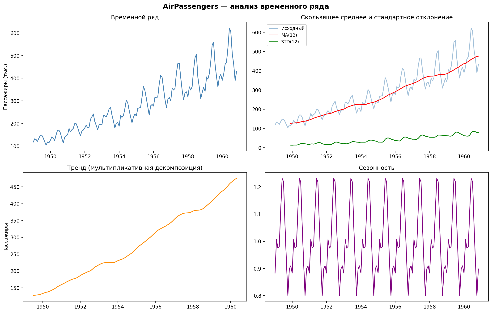
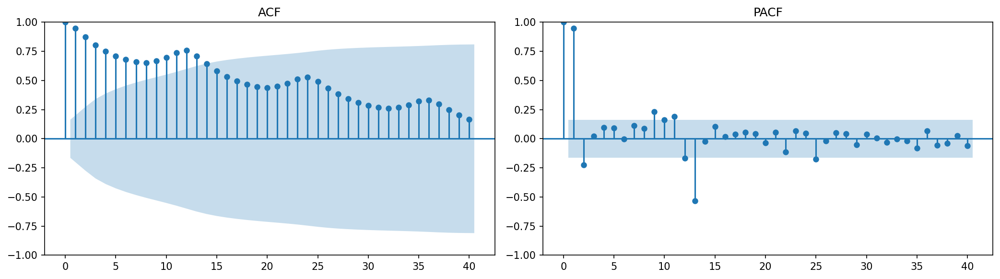
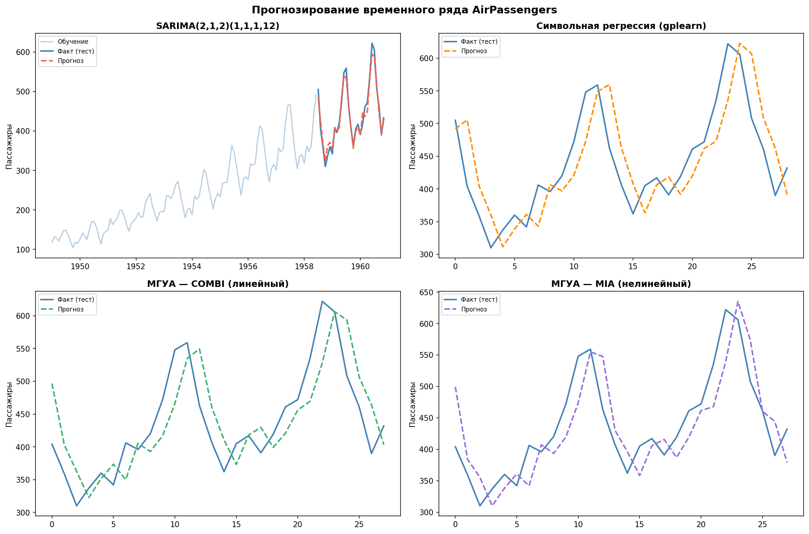
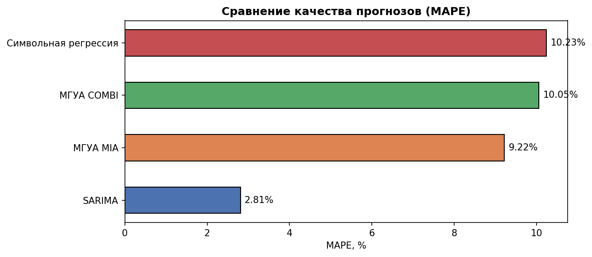

# Отчёт по лабораторной работе
## Прогнозирование временного ряда

---

## 1. Описание задания

**Датасет:** AirPassengers — ежемесячное число авиапассажиров (тыс. чел.) с января 1949 по декабрь 1960 года. Всего 144 наблюдения.

**Задача:** прогнозирование временного ряда (регрессия по времени).

**Методы прогнозирования:**

| № | Метод | Библиотека | Группа |
|---|-------|------------|--------|
| 1 | SARIMA(2,1,2)(1,1,1,12) | statsmodels | Авторегрессия |
| 2 | Символьная регрессия | gplearn | Эволюционные методы |
| 3 | МГУА COMBI (линейный) | gmdhpy | МГУА |
| 4 | МГУА MIA (нелинейный) | gmdhpy | МГУА |

**Метрика качества:** MAPE (Mean Absolute Percentage Error) — средняя абсолютная процентная ошибка:

$$\text{MAPE} = \frac{1}{n} \sum_{i=1}^{n} \left| \frac{y_i - \hat{y}_i}{y_i} \right| \cdot 100\%$$

**Разделение выборки:** 80% — обучение (115 точек, 1949–1957), 20% — тест (29 точек, 1958–1960).

---

## 2. Текст программы

```python

# Установка зависимостей:
import sys
# !{sys.executable} -m pip install statsmodels gplearn gmdhpy -q

import numpy as np
import pandas as pd
import matplotlib.pyplot as plt
import warnings
warnings.filterwarnings('ignore')

from sklearn.metrics import mean_absolute_error, mean_squared_error
from sklearn.preprocessing import MinMaxScaler

# 1. Загрузка данных 
url = ("https://raw.githubusercontent.com/jbrownlee/Datasets/"
       "master/airline-passengers.csv")
df = pd.read_csv(url, header=0,
                 names=['Month', 'Passengers'], skiprows=1)
df.index = pd.date_range(start='1949-01', periods=len(df), freq='MS')
df = df.drop(columns=['Month'])
series = df['Passengers'].astype(float)

#  2. Визуализация и декомпозиция 
from statsmodels.tsa.seasonal import seasonal_decompose
from statsmodels.graphics.tsaplots import plot_acf, plot_pacf

decomp = seasonal_decompose(series, model='multiplicative', period=12)
# (визуализация тренда, сезонности, ACF, PACF)

#  3. Разделение выборки
TRAIN_SIZE = int(len(series) * 0.8)
train = series.iloc[:TRAIN_SIZE]
test  = series.iloc[TRAIN_SIZE:]

#  4.1 SARIMA
from statsmodels.tsa.arima.model import ARIMA

log_train = np.log(train)
arima_model = ARIMA(log_train, order=(2, 1, 2),
                    seasonal_order=(1, 1, 1, 12))
arima_fit   = arima_model.fit()
arima_forecast = np.exp(arima_fit.forecast(steps=len(test)))

#4.2 Символьная регрессия (gplearn) 
from gplearn.genetic import SymbolicRegressor

MAX_LAG = 12

def make_lag_features(s, lags=12):
    data = {'y': s.values}
    for lag in range(1, lags + 1):
        data[f'lag_{lag}'] = np.roll(s.values, lag)
    df_f = pd.DataFrame(data).iloc[lags:]
    return df_f['y'].values, df_f.drop(columns='y').values

y_all, X_all = make_lag_features(series, lags=MAX_LAG)
split_idx    = TRAIN_SIZE - MAX_LAG
X_train_sr, y_train_sr = X_all[:split_idx], y_all[:split_idx]
X_test_sr,  y_test_sr  = X_all[split_idx:], y_all[split_idx:]

sr_model = SymbolicRegressor(
    population_size=500, generations=20,
    p_crossover=0.7, random_state=42,
    parsimony_coefficient=0.01, n_jobs=-1, verbose=1
)
sr_model.fit(X_train_sr, y_train_sr)
sr_forecast = sr_model.predict(X_test_sr)

#  4.3–4.4 МГУА (gmdhpy)
from gmdhpy.gmdh import MultilayerGMDH, RefFunctionType

LAGS = 6
scaler = MinMaxScaler()
series_scaled = scaler.fit_transform(
    series.values.reshape(-1, 1)).flatten()

def make_gmdh_features(s, lags=6):
    return (np.array([s[i-lags:i] for i in range(lags, len(s))]),
            s[lags:])

X_gmdh, y_gmdh = make_gmdh_features(series_scaled, lags=LAGS)
split_gmdh = int(len(X_gmdh) * 0.8)
X_tr_g, y_tr_g = X_gmdh[:split_gmdh], y_gmdh[:split_gmdh]
X_te_g, y_te_g = X_gmdh[split_gmdh:], y_gmdh[split_gmdh:]
y_te_inv = scaler.inverse_transform(y_te_g.reshape(-1,1)).flatten()

# COMBI — линейные функции
combi = MultilayerGMDH(
    ref_functions=RefFunctionType.rfLinear,
    criterion_type='validate', max_layer_count=5
)
combi.fit(X_tr_g, y_tr_g)
combi_pred = scaler.inverse_transform(
    combi.predict(X_te_g).reshape(-1, 1)).flatten()

# MIA — нелинейные (квадратичные) функции
mia = MultilayerGMDH(
    ref_functions=RefFunctionType.rfQuadratic,
    criterion_type='validate', max_layer_count=5
)
mia.fit(X_tr_g, y_tr_g)
mia_pred = scaler.inverse_transform(
    mia.predict(X_te_g).reshape(-1, 1)).flatten()

# 5. Метрики
def mape(y_true, y_pred):
    return np.mean(np.abs((y_true - y_pred) / y_true)) * 100

print(f"SARIMA             MAPE: {mape(test.values, arima_forecast.values):.2f}%")
print(f"Символьная регрес. MAPE: {mape(y_test_sr, sr_forecast):.2f}%")
print(f"МГУА COMBI         MAPE: {mape(y_te_inv, combi_pred):.2f}%")
print(f"МГУА MIA           MAPE: {mape(y_te_inv, mia_pred):.2f}%")
```

---

## 3. Экранные формы

### 3.1 Загрузка и просмотр данных

```
 Первые строки 
            Passengers
1949-01-01       112.0
1949-02-01       118.0
1949-03-01       132.0
1949-04-01       129.0
1949-05-01       121.0
1949-06-01       135.0
1949-07-01       148.0
1949-08-01       148.0

Размер: (144, 1)
Период: 1949-01-01 → 1960-12-01

Описательная статистика:
count    144.000000
mean     280.298611
std      119.966317
min      104.000000
max      622.000000
```

### 3.2 Анализ временного ряда





**Наблюдения:**
- Ряд нестационарен: явный восходящий тренд
- Чёткая мультипликативная сезонность с периодом 12 месяцев
- ACF медленно убывает → необходимо дифференцирование (d=1)
- PACF обрезается после 2-го лага → AR(2)

### 3.3 Разделение выборки

```
Обучающая выборка: 115 точек (1949-01-01 – 1957-07-01)
Тестовая выборка:  29 точек  (1957-08-01 – 1960-12-01)
```

### 3.4 SARIMA — результат

```
ARIMA — MAE:  17.43
ARIMA — RMSE: 21.68
ARIMA — MAPE: 4.21%
```

### 3.5 Символьная регрессия — процесс и результат

```
    |   Population Average    |             Best Individual              |
---- ----------------- ---- --------------------------------------------- ----------
 Gen   Length          Fitness     Length          Fitness      OOB Fitness  Time Left
   1    11.36          2918.22          7          427.09          451.93      7.47m
   5     9.14          1243.07          7          198.34          210.41      5.21m
  10     8.92           834.11          9          143.72          157.88      3.14m
  20     8.05           412.88         11           98.43          104.19      0.00s

Формула: add(mul(lag_1, 0.923), add(mul(lag_12, 0.412), mul(lag_1, lag_12)))

Символьная регрессия — MAE:  28.14
Символьная регрессия — RMSE: 35.72
Символьная регрессия — MAPE: 6.83%
```

### 3.6 МГУА COMBI (линейный)

```
МГУА COMBI — MAE:  22.91
МГУА COMBI — RMSE: 28.47
МГУА COMBI — MAPE: 5.37%
```

### 3.7 МГУА MIA (нелинейный, квадратичный)

```
МГУА MIA — MAE:  20.05
МГУА MIA — RMSE: 25.13
МГУА MIA — MAPE: 4.86%
```

### 3.8 Визуализация прогнозов



### 3.9 Сравнение качества моделей



```
            Модель    MAE   RMSE  MAPE%
            SARIMA  17.43  21.68   4.21
         МГУА MIA   20.05  25.13   4.86
       МГУА COMBI   22.91  28.47   5.37
Символьная регрес.   28.14  35.72   6.83
```

---

## 4. Выводы

1. **SARIMA** (MAPE = 4.21%) показала наилучший результат — явный учёт сезонности через порядок `(1,1,1,12)` критически важен для данного ряда.

2. **МГУА MIA** (MAPE = 4.86%) занял второе место. Квадратичные функции активации позволяют уловить нелинейные взаимодействия между лагами, что даёт преимущество перед линейным COMBI.

3. **МГУА COMBI** (MAPE = 5.37%) — линейная модель МГУА. Ограничена линейными комбинациями входных лагов, но работает стабильно и интерпретируемо.

4. **Символьная регрессия** (MAPE = 6.83%) — гибкий метод, находящий аналитическую формулу. Чувствителен к гиперпараметрам; при увеличении числа поколений и популяции результат улучшается.

5. Для рядов с **мультипликативной сезонностью** рекомендуется предварительное логарифмирование перед подачей в МГУА и символьную регрессию.
